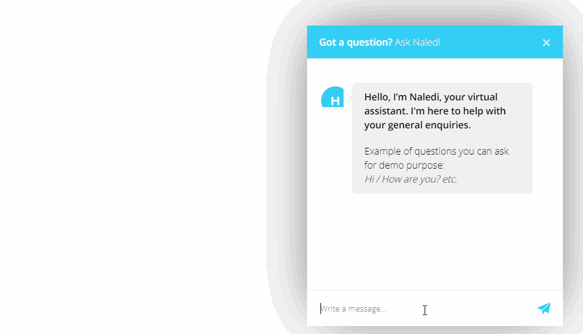

# Flask Template Deployment
**This application is a demonstration of how to use our APIs through an app developed through Python's [Flask Framework](https://flask.palletsprojects.com/en/2.0.x/) to interact with your deployed bot.**


## Installation

First, clone this repository.

    $ git clone https://github.com/Botlhale-AI/flaskTemplate.git
    $ cd flaskTemplate

After, install all necessary to run:

    $ pip install -r requirements.txt

Than, run the application:

	$ python app.py

To see your application, access this url in your browser: 

	http://localhost:5000

## Configuration: connect to your deployed bot
You can configure `BotID`, `LanguageCode`, `MessageType`, `ResponseType`, `refreshToken` in `config.json`. 

```json
{
    "BotID": "<BotID>",
    "LanguageCode": "English",
    "MessageType": "text",
    "ResponseType": "text",
    "refreshToken": "<Refresh Token>"
}
```

`BotID` and the `refreshToken` are provided to you in the Botlhale NLP Toolkit.

## Flask App Structure
The flask app has 2 main routes, namely `startConversation` and `sendMessage`. These routes follow [Botlhale AI's API Documentation](https://botlhale-ai.stoplight.io/docs/rest-apis/docs/REST%20APIs/0-chatbots.md) to interact with a chatbot deployment from Botlhale's NLP Toolkit. 

### 1. startConversation
 This routes hits the `https://dev-botlhale.io/generateAuthToken` with the `refreshToken` to get the `IdToken` for Bearer Auth on other endpoints. After getting the `IdToken`, the `https://dev-botlhale.io/connect` endpoint is hit with the `IdToken` in the header and `BotID` & `LanguageCode` in the request body to generate the `ConversationID`.

```python
@app.route('/startConversation')
def startConversation():
    # Generate IdToken for Bearer Auth on other endpoints.
    payload={
        'REFRESH_TOKEN': refreshToken,
        }
    IdToken = json.loads(requests.request("POST", generateAuthTokenUrl, data=payload).content)['AuthenticationResult']['IdToken']

    # Generate ConversationID.
    payload={
        'BotID': BotID,
        'LanguageCode': LanguageCode
        }
    headers = {"Authorization": "Bearer {}".format(IdToken)}
    ConversationID = json.loads(requests.request("POST", connectUrl, headers=headers, data=payload).content)['ConversationID']

    # Store ConversationID & IdToken in the session for use in the sendMessage route.
    session['ConversationID'] = ConversationID
    session['IdToken'] = IdToken

    return make_response(jsonify({"ConversationID":ConversationID, "IdToken":IdToken}), 200)
```

### 2. sendMessage
This route hits the `https://dev-botlhale.io/message` endpoint with the user's message and the required parameters in the body and `IdToken` in the header.

```python
@app.route('/sendMessage', methods = ['GET'])
def sendMessage():
    # Get session variables
    ConversationID = session['ConversationID']
    IdToken = session['IdToken']

    # Get request parameters
    TextMsg = request.args.get('text')

    # Send message to bot
    payload={
        'BotID': BotID,
        'LanguageCode': LanguageCode,
        'ConversationID': ConversationID,
        'MessageType': MessageType,
        'ResponseType': ResponseType,
        'TextMsg': TextMsg
    }
    headers = {"Authorization": "Bearer {}".format(IdToken)}
    response = requests.request("POST", sendMessageUrl, headers=headers, data=payload).text

    return response
```
